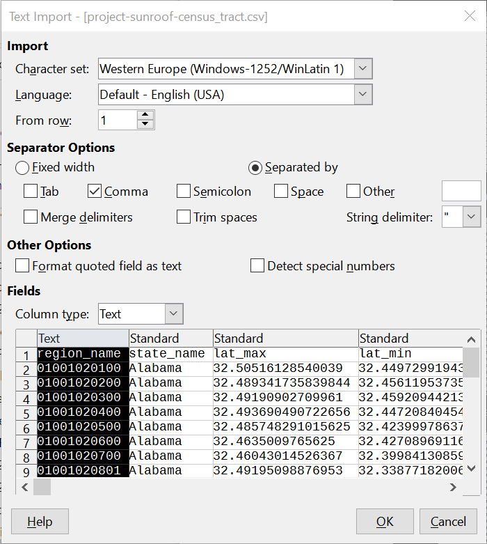

# Loading Numeric Data As Text in ArcGIS Pro

Inevitably as a GIS analyst you will receive a text file (such as a CSV) with ZIP Code data or other numeric data that is not actually quantitative. You will load the data in ArcGIS Pro and try to join it to another dataset with ZIP Codes only to find that ArcGIS Pro does not let you complete the join. Or, you may look at the data and notice that the ZIP Codes in New Jersey or Massachusetts have only four digits. What's going on?

ArcGIS Pro has loaded the data as numbers. Since it is quantitative, it can't be joined to a matching field in another dataset that is properly formatted as text. ZIP Codes that begin with 0 have the leading zero dropped. This problem applies to any numeric but non-quantitative identifier, such as FIPS codes other [geographic identifiers (GEOIDs) used by the Census Bureau](https://mcdc.missouri.edu/applications/geocodes/) in their data products.

Here are three ways to get ArcGIS Pro to correctly interpret ZIP Codes and GEOIDs as text:

## Use a schema.ini file

In the same folder as the CSV you want to load, create a new text file named `schema.ini`. Open the file and create the following entry for each column in each file that you want to fix:

```
[filename.csv]
Coln=my_column_name Text
Coln=my_other_column_name Text

[filename2.csv]
Coln=some_other_column Text
```

`Col`*n* must be replaced with the actual column number. I haven't figured out a way to shortcut this. There is a `ColNameHeader=True` setting, but when I used it I got an error when I tried to load the file. Unfortunately if you have a table with a lot of columns, you will have to count to figure out the number of the one you want to correct.

`my_column_name` should be replaced with an actual column name. If the column name has spaces, it should be quoted. For example:

```
[Demographics by ZIP Code.csv]
Col23="ZIP Code" Text
```

Other data types than text can be specified as well. This might be useful if, for example, you have integer data that you want to load as float. It might also be useful if most of the data is integer, but a decimal value appears far down the column. The loader scans only the top of the file to determine the data type, so it might generate an error in this case. (I can't find documentation on how many rows it scans by default.)

More info on this solution is available at the following links:

* <https://pro.arcgis.com/en/pro-app/latest/help/data/tables/add-an-ascii-or-text-file-table.htm>
* <https://docs.microsoft.com/en-us/sql/odbc/microsoft/schema-ini-file-text-file-driver> – Note that there is a broken link in the ArcGIS Pro docs; I think this is where it is supposed to point

## Use LibreOffice Calc to convert the file to DBF

[LibreOffice](https://www.libreoffice.org/download/download-libreoffice/) Calc (an open source alternative to MS Excel) allows you to load the problematic column as text, then save the file to the DBF format that ArcGIS uses for tabular data.

* Load in LibreOffice Calc. The Text Import dialog should appear. Calc should recognize that the file is "delimited" as opposed to fixed width, but if it doesn't, choose the radio button for "Separated by", and make sure that Comma (only) is checked.
* Select the column that should be read as text. This could be a column of ZIP Codes, Social Security Numbers, GEOIDs, etc. Hit OK.
    
    
* Use the Save As dialog to save it to dBASE (dbf) format. The DBF file can then be added to ArcGIS Pro and the column will be recognized as text.

## Create a line of dummy data

Since ArcGIS Pro scans the top of the file to determine the data type, you can force it to read a column as text by having non-numeric data near the top of the column. You can similarly force integer data to be read as floating point by having a decimal value (like 1.0) somewhere near the top.

* In Calc or in a text editor, insert a new row immediately below the header. If you are using a text editor, you need to have the same number of commas or tabs as in every other row. Consider duplicating the first data row as a shortcut to getting the right number of fields.
* Put the letter "a" (really, any letters or words) in the any column that you want loaded as text.
* Put "1.0" in any column that you want loaded as float.
* The rest of the row can be left blank, and will be interpreted as NULL when the data is loaded.
* If using a text editor, just save and close. If using Calc, go to File->Save As and choose Text CSV (*.csv). **Make sure to check "Edit filter settings"**, and when the Export Text File dialog appears check "Quote all text cells".

When you add this file in ArcGIS Pro, you will have this dummy row of not-real data. Do be careful not to use it in your analysis! Usually this won't be a problem because a typical use case is to join the tabular data to a spatial layer. The unmatched row with the dummy data will doubtless not be present in the spatial layer you are joining to (e.g. ZIP Code polygons), and will be dropped from your subsequent workflow.

## THINGS THAT DON'T WORK

You may already have tried this and found they didn't work.

### Using Excel

Microsoft Excel does not appear to have the text importer that Calc does. When I loaded ZIP Codes in Excel, it seems to automatically interpret the data as numeric, and saving it to CSV will drop the leading zeroes in the text file as well. That is, what looks like just a display issue will actually alter your data in undesirable ways. **In general, I recommend never loading CSVs in Excel.** I usually use a text editor for a quick view of the content, or Calc if I need to see it in tabular form.

### Putting quotes around the numeric data

Many software packages that work with text data (including Calc) will allow you to force quote text fields. This is specifically to make sure that ZIP Codes like "03755" get loaded as text. But the behavior is up to the loader, and unfortunately, ArcGIS Pro can't take the hint. It will ignore the quotes and load quoted numeric fields as quantitative data types such as integer or float.

